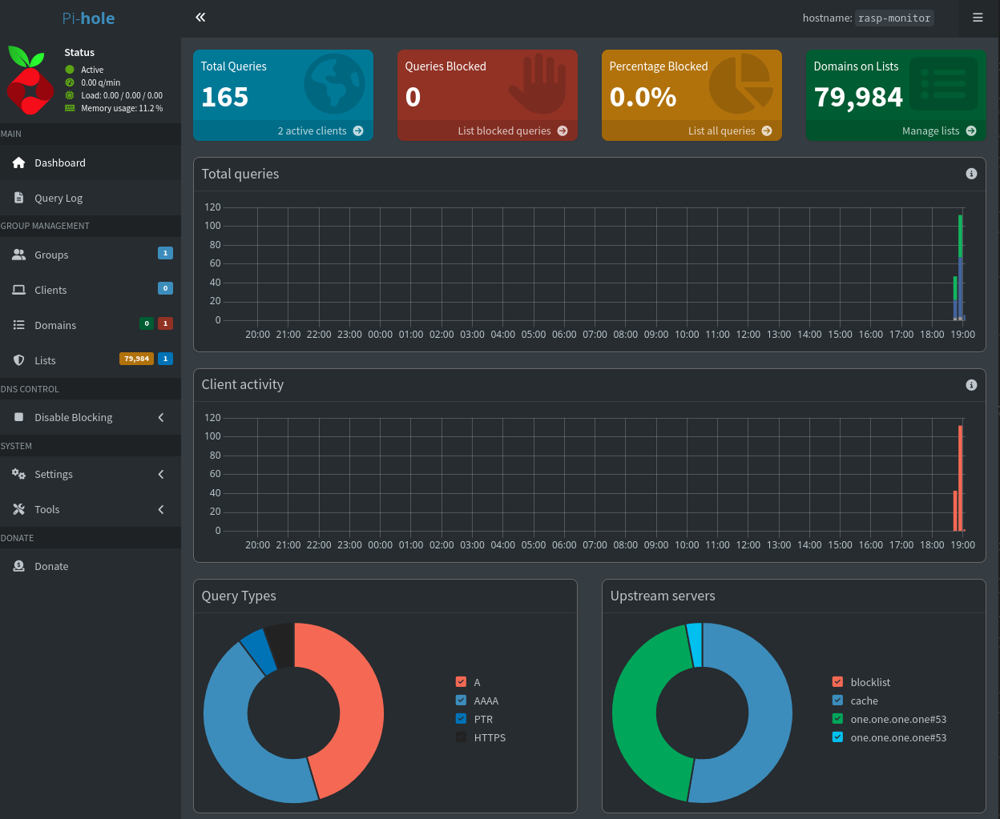

# Pi-hole setup 


## Introduction

In this project I will be turning Raspberry Pi into a DNS filtering device. The goal is to improve network privacy and reduce bandwidth usage by blocking unwanted domains at the DNS level. This README will serve as documentation and possibly as a guide. I will be using Pi 3B+ but you can use any Pi you have. This project is not limited to Pi's either. You can use any computer you have laying around.

### What is Pi-hole?

Pi-hole is a network-wide ad-blocking software that acts as a DNS sinkhole to block ads and trackers on all devices in the network.


## Setting up Raspberry Pi

### 1. Pi installer

First we need to install OS to the SD card. Start by going to www.raspberrypi.com/software/ and download the one for your current OS.

Im using arch so for me it was:

```sudo pacman -S qt5-base qt5-svg curl``` (depencensies)

```yay -S rpi-imager```

Now we can proceed to installing the OS. 

First you need to choose your device, for me this is Raspberry 3 then OS will be Raspberry Pi OS Lite 64-bit, this is lightweight without GUI. Finally choose the storage.

After clicking `Next` the rpi imager will ask you if you want to set custom os settings. Here we wanna click `Edit settings`.

On `General` tab you wanna set following:

- `Hostname`
- `Username`
- `Password`
- `Time zone`
- `Keyboard layout`

You can also set Wifi on this page but I will be using LAN.

On `Services` tab you want to enable `SSH` with password authentication.

Finally click `Save` and now when asked would you like to apply OS customisation settings click `Yes`. On the next prompt also click `Yes`

Now we wait for the rpi imager to write the OS to the sd card. This takes 5-10 minutes.
After installation is done remove the sd card and insert it into the Pi and power it on.


## Connecting

Now that we have OS installed and Pi is running, we need to connect to it. First you need to find the IP, I did this by logging into my routers admin panel and looking for LAN clients. For me the IP was 192.168.0.11.

Connect to the device with ssh by typing `ssh username@ip` for me it was `ssh tino@192.168.0.11` on first connection it will ask about a key, type yes and then you will be prompted for password, after typing password you should be in!

**Note on Security:** It is considered a best practice to disable password login and enforce SSH Key-based authentication to prevent brute-force attacks. While this step is optional and not strictly necessary to complete this project, it is highly recommended for any permanent setup.

## Setting up Pi-hole

We wanna start by doing system update `sudo apt update && sudo apt upgrade -y`

Now we are ready to install Pi-hole `curl -sSL https://install.pi-hole.net | bash`

### Pi-hole Automated Installer

Lets begin! Click `OK` or press `enter`

### Open Source Software 

Click `OK` or press `enter` here aswell

### Static IP Needed

Installer should start automatically, click `ok` on the two first windows but after that you will get message `Static IP needed`. To give your Pi static IP you need to go to your routers settings. If your not sure about this google or chatgpt `how to add static ip to device on _your router_`

Once that is done you can click `continue` on the installer.

### Upstream provider

On the next page we are gonna choose Upstream Provider. This means that Pihole does not directly answer all DNS queries on its own, it forwards unresolved requests to and "upstream provider", which is and external DNS server. That upstream server then resolves the domain name and returns results back to Pihole, which in turn responds to the device that made the request.

Im gonna go with `Cloudflare`

### Blocklists

On next page you will be asked about blocklists and you want to include `StevenBlacks Unified Hosts List` so just press `Yes`.

### Enable logging

`Query Logging` means that Pihole records all DNS requests made by devices on your network. This allows you to see which domain were quaried and know which device made the request. It also tracks what was blocked or allowed. It can be useful but may also raise some privacy concerns. Im gonna go with `Yes`

### Privacy mode for FTL

As for privacy mode for FTL I'm going to go with option `0 – Show Everything`, which allows full logging and visibility of all DNS queries and devices. This is ideal for home use where monitoring and statistics are important.

If you're only using Pi-hole to block ads and don't care about logging or device-level tracking, you can choose option `2` or `3` for more privacy.


### Installation Complete!

After choosing privacy mode, the installer is gonna finnish installation and you will get final prompt. Here you will see your Pi-hole `IP` and `Admin Webpage login password`, remember to type the password down!

You can access the web interface from `http://PIHOLE_IP/admin` or `http://pi.hole/admin`

You can change your Pi-hole password by typing `sudo pihole setpassword`


### Admin page

Now we should be able to access the Pi-hole admin interface. However as you can see there are no DNS queries yet. This is because the router is still sending DNS traffic elsewhere.

To fix this we need to make one final adjustment to the routers settings. Set the routers DNS server to point to the IP address of the Pi-hole. This will route all network DNS queries through Pi-hole, allowing it to monitor, filter and ad-block!

### Block list

There is many blocklists available on the internet. The one I will be using is: 
- **https://raw.githubusercontent.com/StevenBlack/hosts/master/hosts**

Under `GROUP MANAGEMENT` go to `Lists`, there you can copypaste the github link to the address bar and click `Add blocklist`


### We are done!




### Full PI-hole documentation

You can find full Pi-hole documentation here **https://docs.pi-hole.net/**

---

